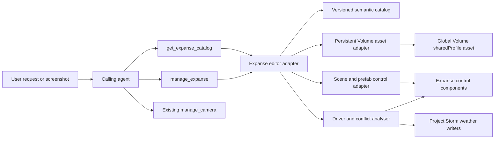

# Architecture Decision Plan: Project Storm Expanse MCP Support

Status: Superseded by `plans/project-storm-environment-support.md`
Last updated: 2026-08-16
Verdict: Superseded after brainstorm expanded the boundary to full Project Storm environment support
Confidence: High

## Goal

Add project-specific Expanse support to the Unity MCP fork so an agent can inspect and configure Project Storm's Expanse environment from a natural-language request or a screenshot-led visual request. Persistent HDRP environment changes must modify the Global Volume Profile asset itself, while Expanse scene and prefab control components are adjusted through their authored component surfaces.

The tooling is built and tested primarily in `G:\unity-mcp-Transformative` before that MCP package is installed into Project Storm.

## Scope Boundaries

- Support Project Storm's installed Expanse 1.7.6 and HDRP 14 / Unity 2022.3 environment.
- Treat local installed types and serialized structure as authoritative; use the public Expanse documentation as conceptual and API guidance.
- Interpret screenshots in the calling agent. Reuse the existing camera/screenshot tooling for visual iteration.
- Exclude `TornadoCloudVolume` and the current tornado extension. Preserve only a generic extension seam for a future replacement.
- Do not absorb Project Storm's weather managers into Expanse tooling. Detect their control relationships and warn about conflicts.
- Do not add Expanse, HDRP, or SRP Core as compile-time dependencies of the MCP package.

## Architecture Decision

Add two dedicated first-class MCP tools in the existing `vfx` group:

1. `get_expanse_catalog` — read-only Inspection for status, discovery, description, inspection, compatibility diagnostics, and mutation preflight.
2. `manage_expanse` — Project Automation for approved, persistent Expanse and bounded companion HDRP changes.

Natural-language and screenshot interpretation stays with the calling agent. The MCP tools accept deterministic structured operations and return structured evidence, warnings, and change journals.

## Ownership and Component Boundaries

### Calling Agent

- Converts natural language and screenshots into structured intent.
- Uses catalog/preflight results to choose valid component surfaces and values.
- Iterates visually through existing screenshot/camera tooling.
- Does not depend on an image-analysis service inside the Unity MCP server.

### Python MCP Server

- Owns stable public schemas, tool descriptions, annotations, validation, transport, and Unity-instance routing.
- Remains a thin wrapper around Unity editor commands, following the existing ModernUI pattern.
- Registers both tools in the existing `vfx` group rather than introducing a new tool-group taxonomy.

### Unity MCP Editor Package

- Owns Expanse installation detection and compatibility fingerprinting.
- Performs bounded reflection and serialized-property discovery over approved Expanse and HDRP types.
- Builds the semantic catalog and resolves exact targets.
- Resolves and persistently edits Volume Profile assets.
- Inspects and mutates Expanse scene/prefab controls.
- Detects Creative-to-Advanced drivers and known external writers.
- Coordinates preflight, Undo, dirty state, asset saving, verification, and change journals.
- Reuses or extracts the existing internal Volume reflection helpers rather than recursively invoking the public `manage_graphics` tool.

### Project Storm

- Owns Expanse source, assets, prefabs, presets, Global Volume Profiles, scenes, and game-specific weather systems.
- Remains the real integration target after the MCP tooling has passed synthetic tests.

## Persistent Volume Asset Rule

All persistent environment operations resolve the Global Volume's `sharedProfile` and edit that asset's VolumeComponent subassets directly. The tooling must never use `Volume.profile` for persistent authoring because accessing it creates or returns a Volume-specific instantiated clone.

The persistent adapter must:

- Resolve by exact asset GUID/path or through an exactly selected Volume's `sharedProfile`.
- Reject ambiguous or fuzzy mutation targets.
- Report an instantiated runtime/editor clone if one exists, but never save it as the baseline.
- Edit `ExpanseSettings` plus an explicit allowlist of required companion HDRP overrides.
- Mark changed VolumeComponent subassets and the containing VolumeProfile dirty.
- Save only after successful preflight and mutation verification.
- Reject persistent authoring while Unity is in Play Mode.

Project Storm weather scripts currently access `expanseVolume.profile` for runtime Fog changes. Those runtime clones are separate from the authored persistent baseline and must be reported as such.

## Expanse Control Authority

Expanse configuration spans two related surfaces:

1. HDRP Volume configuration, principally `ExpanseSettings` and the HDRP `VisualEnvironment` activation settings.
2. Expanse scene or prefab MonoBehaviours such as Global Settings, atmosphere, celestial bodies, lights, fog, and cloud controls.

Authority policy:

- Prefer a Creative control when an active Creative component drives an Advanced component.
- Permit direct Advanced control when there is no active Creative driver.
- Do not silently edit a field that an edit-mode driver will overwrite on the next update.
- Detect and report known Project Storm weather-manager references that may supersede authored settings at runtime.
- Keep direct management of Project Storm weather states and presets outside this tool boundary.

## Catalog and Compatibility Strategy

Use a hybrid catalog:

- Runtime reflection supplies installed types, serialized fields, enums, ranges, tooltips, and asset-reference shapes.
- A small MCP-owned semantic overlay describes user-facing concepts, valid relationships, safe control surfaces, and setup invariants.
- The overlay is keyed by a compatibility fingerprint based on required type/member signatures rather than relying only on a version string.
- Unknown or incomplete fingerprints remain inspectable but fail closed for mutations that depend on uncertain semantics.
- Cache catalog results per editor domain and invalidate them on domain reload or relevant asset/package changes.

Do not copy Expanse source, shaders, textures, prefabs, presets, or other vendor assets into the MCP repository or synthetic test project.

## Transaction and Persistence Model

Scene/prefab mutations and persistent asset mutations cannot be made truly atomic on disk. Use a coordinated transaction model:

1. Read-only preflight resolves every target, validates compatibility, identifies drivers, and produces an immutable proposed-change journal.
2. Scene and prefab changes use one Unity Undo group.
3. Persistent Volume Profile changes use an explicit asset-save boundary after all in-memory changes succeed.
4. Post-apply verification rereads the intended targets.
5. Failures return `partial_failure` or `recovery_required` with the exact change journal and recovery guidance.

The tool must not automatically save the current scene. It reports whether the scene or prefab stage became dirty.

Existing authored content remains user-owned. A ModernUI-style ownership manifest is not required for ordinary Expanse editing. Ownership metadata may be reconsidered only if a later feature generates complete managed environment setups.

## Security and Tool Authority

- `get_expanse_catalog`: `ToolCapability.Inspection`, read-only annotation.
- `manage_expanse`: `ToolCapability.ProjectAutomation`, destructive annotation and local Unity-session approval.
- Allowlisted namespaces, component families, and serialized properties only.
- No arbitrary method invocation, unrestricted reflection, source generation, or arbitrary object construction.
- All asset paths constrained beneath `Assets/` and normalized before use.
- Mutation requires exact object or asset identity.
- Tool responses expose bounded structured summaries rather than unbounded serialized object dumps.

## Versioning and Deployment

- Add a versioned Expanse request/spec contract and a returned compatibility/schema version.
- Treat the Python server and Unity package as a paired build from the same pinned fork commit.
- Do not infer compatibility merely from the current package strings; the repository currently has different Python-server and Unity-package version strings.
- Install into Project Storm only after the tooling compiles and passes its synthetic Python and Unity Edit Mode suites.
- Perform real-project acceptance against a source-controlled Project Storm checkout before normal use.

## Testing Boundary

The MCP repository tests against synthetic fixtures rather than licensed Expanse implementation or assets.

Required test layers:

- Python wrapper, schema, validation, routing, and tool-group registration tests.
- Unity Edit Mode tests with synthetic Expanse-like types and serialized shapes.
- `sharedProfile` persistent-asset tests, including clone rejection.
- Creative/Advanced driver conflict tests.
- Unknown-version, missing-type, malformed-profile, and ambiguous-target tests.
- Project Automation authorization tests.
- Transaction journal, partial-failure, dirty-state, and no-auto-scene-save tests.
- Project Storm acceptance after later installation.

## Rejected Alternatives

### Add Expanse actions to `manage_graphics`

Rejected because generic graphics actions cannot safely represent Expanse control relationships, edit-mode clobbering, version knowledge, or project-specific writer diagnostics. Generic Volume primitives can be reused internally without combining the public contracts.

### Put the integration inside Project Storm

Rejected because it splits the transport/automation implementation across repositories, prevents the requested tooling-first workflow, and makes synthetic testing and security review harder.

### Compile directly against Expanse or HDRP

Rejected because it couples the reusable MCP editor assembly to optional vendor/package versions and would prevent the MCP test project from compiling without those packages.

### Add image interpretation to the MCP server

Rejected because the calling agent already accepts screenshots and the existing camera tool supplies visual feedback. A second vision subsystem would add cost and complexity without improving Unity-side determinism.

## Operational Characteristics

- Local MCP/Unity operation only; no new hosted services or databases.
- No new API keys or third-party runtime costs.
- Inspection remains bounded and read-only.
- Mutation remains approval-gated and source-control recoverable.
- Logs and telemetry should contain tool/result metadata, not raw screenshots or unbounded serialized asset content.

## Handoff to Brainstorm

Confirmed architectural decisions:

- Two dedicated Expanse tools in the existing `vfx` group.
- Thin Python wrappers and Unity-editor semantic authority.
- Persistent `sharedProfile` asset editing.
- Separate handling for Volume Profile settings and Expanse scene/prefab controls.
- Dynamic reflection with versioned semantic overlays and no compile-time vendor dependency.
- Agent-side screenshot interpretation and existing camera-tool reuse.
- Creative/Advanced and Project Storm writer conflict detection.
- No current tornado support.
- No licensed vendor implementation/assets in the MCP repository or synthetic tests.

Feature questions for brainstorm:

- Which Expanse component families and bounded HDRP companion overrides belong in V1?
- Does V1 only inspect/modify existing setups, or may it create complete setups from installed Expanse prefabs?
- What is the public structured request/spec shape?
- How should users explicitly resolve or override a detected driver conflict?
- What constitutes an end-to-end demonstrable first slice before Project Storm installation?
